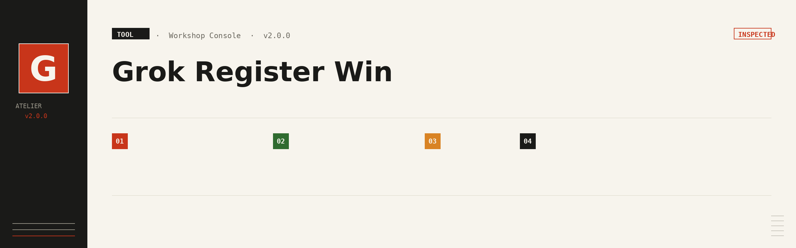

# Grok Register Win



Windows 下双击即用的 Grok（xAI）账号自动注册面板。基于浏览器自动化完成注册，自动换取 CPA OAuth 凭证，并开启 NSFW 偏好。

## 功能

- **代理**：复用本机 Clash，自动探测端口（Clash Verge 默认 `7897`）
- **注册引擎**：Chromium 有头 / Camoufox 无头反检测，面板下拉切换
- **邮箱**：内置 Tempmailer，或对接自建临时邮 API
- **SSO → CPA**：注册成功后自动把 web SSO 换成 CLIProxyAPI 可用的 OAuth JSON
- **NSFW 自动开启**：注册成功后自动设置 ToS、生日、NSFW 偏好
- **产物下载**（同一批账号，三种格式，不重复注册/换票）：
  - SSO TXT：`email----password----sso`
  - CPA ZIP：`xai-*.json`（`auth_kind=oauth`，CLIProxyAPI）
  - Sub2 ZIP：`sub2api-data` 官方导入包（单账号 `grok-*.json` + 合集 `all.json`，可一键导入）
- **账号管理**：面板内勾选删除，避免重复下载

> 仅供学习研究。自动化注册可能违反平台条款，风险自负。

---

## 环境要求

| 项 | 说明 |
|----|------|
| 系统 | Windows 10 / 11 |
| Python | 3.10+（安装时勾选 *Add python.exe to PATH*） |
| 代理 | 本机 Clash（Clash Verge / CFW / mihomo 均可），订阅与节点在 Clash 内管理 |
| 浏览器 | Chrome 或 Edge（Chromium 有头引擎默认调用） |
| Camoufox | 可选；首次切换会自动下载 Firefox 二进制 |

---

## 快速开始

1. 下载仓库 ZIP 并解压
2. 打开 Clash，选一个可用节点
3. 双击 `start.bat`
   - 首次启动自动创建 `.venv` 并安装依赖，窗口请勿关闭
   - 失败日志见 `data\logs\start.log`
4. 浏览器自动打开 http://127.0.0.1:8787（免密直进）
5. 在「邮箱服务」选择 Tempmailer 或自定义，保存
6. 点 **开始注册**
7. 完成后下载 SSO / CPA / Sub2，不需要的账号可勾选删除
   - Sub2：点「下载 Sub2」→ 解压后用 `all.json`（或单个 `grok-*.json`）在 Sub2API「导入数据」上传

> 双击窗口一闪即关：请使用 `start.bat`，并确认 Python 3.10+ 已加入 PATH。

---

## 配置

首次运行从 `config.example.json` 生成 `config.json`。

```json
{
  "proxy": "http://127.0.0.1:7897",
  "allow_proxy_fallback": false,
  "browser_engine": "chromium",
  "email_provider": "tempmailer",
  "email_failover": true,
  "register_count": 1
}
```

| 字段 | 说明 |
|------|------|
| `proxy` | Clash 代理地址；端口不通时启动会自动探测并写回 |
| `allow_proxy_fallback` | 代理失败是否回退直连，默认 `false` |
| `browser_engine` | `chromium`（有头，默认）或 `camoufox`（无头反检测） |
| `email_provider` | `tempmailer` 或 `custom` |
| `email_failover` | 邮箱失败自动切换备用 |
| `register_count` | 单次任务注册数量 |

### 邮箱

| 选项 | 说明 |
|------|------|
| Tempmailer | 内置免 key（默认 `bluenode.cc`） |
| 自定义 | 自建临时邮 API（兼容 cloudflare_temp_email）：API 根地址 / Key / 域名 / 路径 |

自定义服务需支持「创建地址」和「收信读验证码」。

### 环境变量（高级）

| 变量 | 含义 | 默认 |
|------|------|------|
| `PANEL_AUTH` | 是否开启登录（`1` 开启） | `0`（免密） |
| `PANEL_PASSWORD` | 登录密码（仅 `PANEL_AUTH=1` 生效） | `admin` |
| `PANEL_PORT` | 面板端口 | `8787` |
| `GROK_PROXY` | 覆盖 `config.json` 代理 | — |

面板默认仅监听 `127.0.0.1` 且免密。需加密码时：

```powershell
$env:PANEL_AUTH="1"
$env:PANEL_PASSWORD="你的密码"
.\start.bat
```

---

## 目录结构

```
grok-register-win/
├── start.bat                 # 双击启动
├── launcher.py               # 启动器（代理探测、Playwright 修补）
├── grok_register_ttk.py      # 注册主程序
├── config.example.json
├── panel/app.py              # Web 面板
├── lib/
│   ├── sso2cpa_core.py       # SSO → CPA 转换核心
│   ├── camoufox_backend.py   # Camoufox 无头适配层
│   └── patch_playwright.py   # Playwright 驱动崩溃自动修补
├── data/
│   ├── logs/                 # 运行日志
│   └── cpa/                  # 已转换 CPA JSON
├── docs/                     # 截图与文档
└── accounts_*.txt            # 注册产出
```

---

## 常见问题

### 代理端口不通 / WinError 10061
- 确认 Clash 已启动
- Clash Verge 默认端口 `7897`
- 修改 `config.json` 的 `proxy` 后重启 `start.bat`（启动会自动探测）

### 注册大量失败 / 验证码或页面异常
- **绝大多数失败来自网络环境**，不是脚本本身
- 实测机场节点里 **日本** 更稳；新加坡 / 美国 / 德国成功率偏低
- 失败时先在 Clash 换日本节点，再点「开始注册」
- 面板「启动注册」卡片下也有同样提示

### 卡在 Cookie / 拿不到 SSO
- 已自动点击「接受所有 Cookie」
- 仍失败请换节点重试（优先日本）

### 依赖安装失败
```bat
.venv\Scripts\python.exe -m pip install -r requirements.txt -i https://pypi.tuna.tsinghua.edu.cn/simple
```

---

## 更新日志

### v1.0.7（2026-07-16）
- 新增「下载 Sub2」：从已转换 CPA 现场映射为 Sub2API 官方导入包（`type=sub2api-data` / `version=1`）
- 主页三种产物并列：SSO TXT、CPA ZIP、Sub2 ZIP（不重跑注册/换票）
- Sub2 ZIP 对齐 CPA：`README.txt` + 单账号 `grok-*.json` + 合集 `all.json`
- 映射字段：`expired`→`credentials.expires_at`，`platform=grok`，`type=oauth`，`proxies=[]`
- Sub2 按钮样式与 SSO/CPA 同为渐变实心按钮
- 启动注册区增加网络提示（日本节点更稳）；邮箱区空 hint 自动隐藏；README FAQ 补充节点建议

### v1.0.6（2026-07-16）
- 修复 CPA 转换在中文路径下失败：curl_cffi 无法处理非 ASCII CA 证书路径，启动时自动复制到 `%TEMP%`
- 面板 UI 美化：Grok 风格 logo（黑底白字）、卡片渐变指示条、按钮/表格悬停效果
- 运行日志过滤：去重复时间戳、过滤 Cloudflare 轮询刷屏、去重信息行、超长截断
- 免密模式启动不再显示误导性密码提示

### v1.0.5（2026-07-16）
- 修复 CPA 转换 404：consent 提交改为标准 HTML 表单 POST，从 302 重定向提取 OAuth code
- 修复 Windows GBK 编码崩溃：入口文件强制 UTF-8 输出
- 修复 Playwright 驱动崩溃：新增 `lib/patch_playwright.py` 启动时自动修补
- 扩展注册提交按钮检测（`<a>` 标签 + 更多文本模式）
- Camoufox 浏览器崩溃快速失败，避免反复超时

### v1.0.4（2026-07-16）
- 新增 Camoufox 无头引擎（基于 Firefox 反检测，GeoIP 自动对齐时区/语言）
- 面板下拉切换 Chromium 有头 / Camoufox 无头
- 首次使用自动下载 Firefox 二进制与 GeoLite2 数据库

---

## License

本项目基于 [MIT License](LICENSE) 发布。若上游组件另有协议，以对应文件为准。
